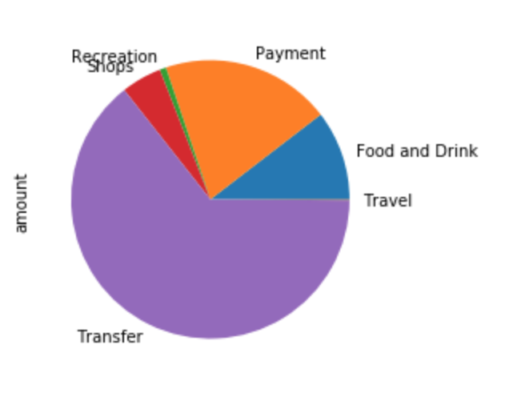
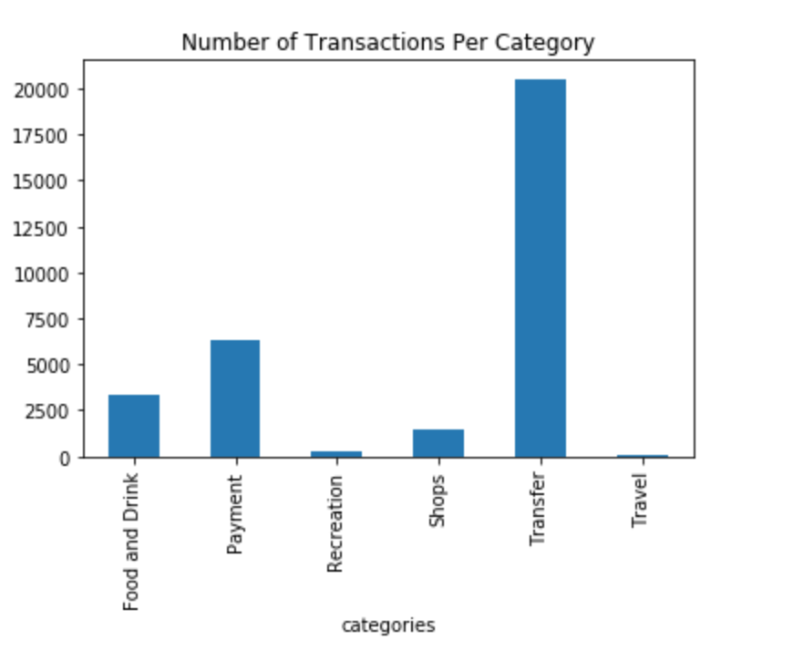
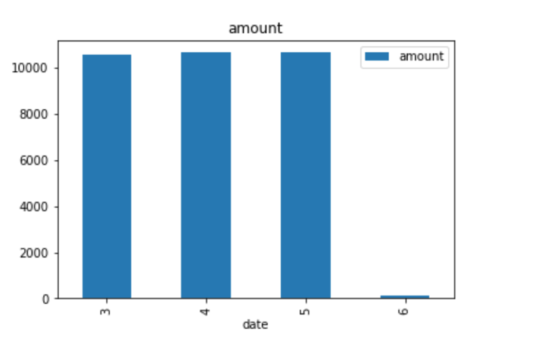
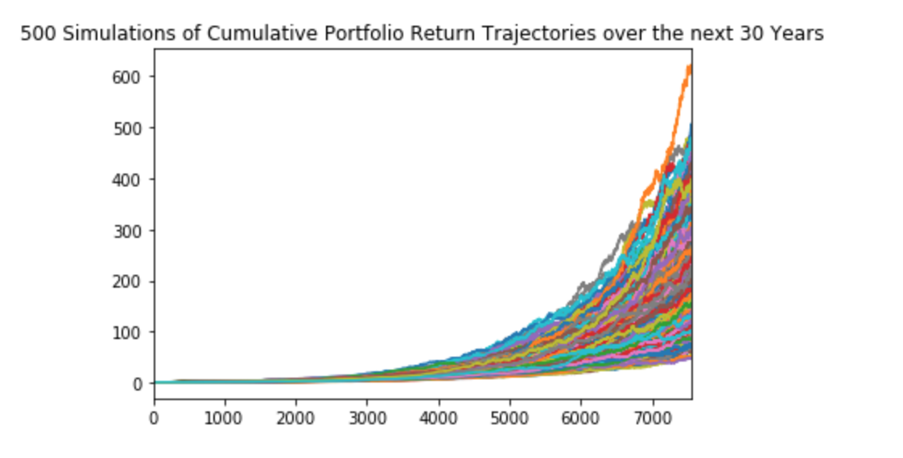
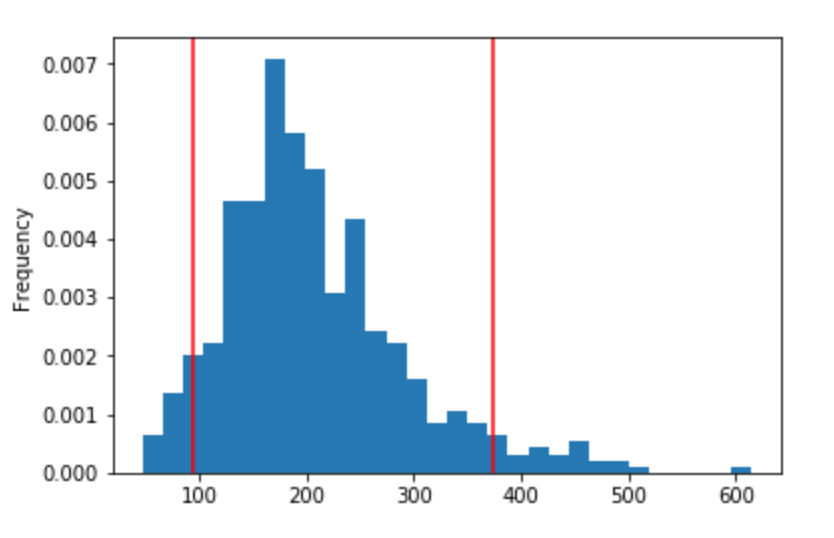

# Harold's Financial Report - 06/10/2020

Provided is an analysis of Harold's spending habits and retirement plan. 

## Budget Analysis
Harold's spending habit exceeds his income. Currently, Harold is spending $10k a month , with a monthly income of only $500.
Harold is in desperate need of additional income.

### A summary of Harold's income:

Time Period | Income
----------- | -------
Previous Year Gross Income | $7,285
Monthly Income | $500
Projected Gross Income | $7,389
-----------------------
### Spending Per Category:
Per category it is clear that Harold is transferring alot of money.  The data doesnt support how Harold acquired the funds based upon his current annual income.

### Number of Transactions Per Category:
Outside of transfer and spending Harold does eating out regularly.  Cutting spending going out to eat could assist his current finanical perdicament.

### Spending by Month:
Harold spends roughly 10k per month.

## Retirement Planning
Provided below is the Monte Carlo projection of cumulative returns of a portfolio with 60% allocated to SPY and 40% allocated to AGG over the course of 30 years.

Illustrated below the figure shows the distribution of ending returns for the proposed portfolio within a 90% confidence interval. This portfolio has a range of outcomes from the initial investment growing between 100% to 400%.

The chart below shows various outcomes at the 10th, 50th, and 90th percentile.

Percentile | Cumulative Returns
-----------|------------------
10th percentile |117.37594573549154
50th percentile |189.84383253943383
90th percentile |374.69326161033706

The projected value of an inital investment of $20,000 ranges from $234,000 to $750,000.

Percentile | Value
-----------|----------------
10th percentile | $2347519.0
50th percentile | $3796877.0
90th percentile | $7493865.0
----------------------------------
Harold's current projected annual income is $7,389.  Assuming a 4% withdrawal rate in 30 years on a $50,000 inital investment, Harold's projected portfolio would not suffice.  
------------------------------------------------
Income with an 4% withdrawal rate at the 10th percentile: $4,858.

A 50% increase in the initial investment ($75,000) would still not be enough due to Harolds current income.
---------------------------------------------------
Income with an 4% withdrawal rate with an $75k initial investment: $7,287.45

## Summary

Harold's plan to retire in 5 years is very unlikely.  For Harold to retire in  30 years, Harold needs to invest more than $50,000, and seriously re-evaluate his spending habits
